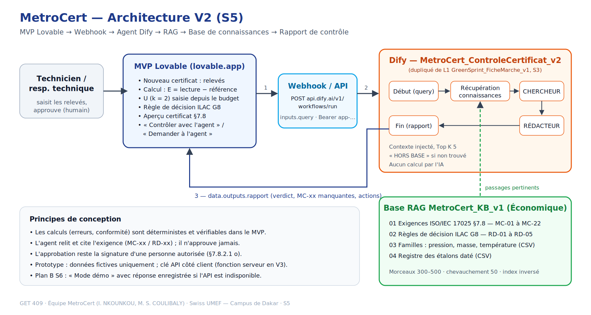

# GET409 — MetroCert

> Générateur de certificats d'étalonnage multi-instruments et multi-sociétés, conformes à l'ISO/IEC 17025:2017.

## Notre équipe

| Prénom Nom | Rôle | GitHub |
|---|---|---|
| Ivon NKOUNKOU | Chef de Produit (PM) · Dev UI (No-Code) | @nherrys2026-max |
| Maimouna Sira COULIBALY | Master Prompt Engineer · Responsable Impact & Éthique | coulibalymaimounasira@gmail.com |

Contacts GitHub de l'équipe : nherrys2026@gmail.com · coulibalymaimounasira@gmail.com

## Notre défi

**Secteur :** Industrie et qualité — métrologie et étalonnage des instruments de mesure (laboratoires d'étalonnage, services métrologie internes des industries agroalimentaire, pharmaceutique, pétrole et gaz, mines, BTP), Sénégal / zone UEMOA.

**Problème (1 phrase) :** Au Sénégal, les laboratoires d'étalonnage rédigent encore leurs certificats à la main dans des modèles Word/Excel différents pour chaque type d'instrument et chaque client, ce qui génère des erreurs, des retards de livraison et des écarts relevés lors des audits d'accréditation.

**HMW définitif (S2) :**

> « Comment pourrions-nous permettre aux **responsables techniques de laboratoires d'étalonnage au Sénégal, comme Mame Diarra**, qui jonglent avec un modèle de certificat différent par famille d'instruments et par client, de **passer des relevés de mesure à un certificat conforme à l'ISO/IEC 17025 sans aucune ressaisie**, afin de **livrer leurs clients dans la journée** et de **passer leurs audits d'accréditation sans écart** lié aux certificats ? »

*HMW S1 : « Comment pourrions-nous permettre aux techniciens et responsables de laboratoires d'étalonnage de générer, pour n'importe quel instrument et n'importe quelle société cliente, un certificat d'étalonnage conforme à l'ISO/IEC 17025 en quelques minutes, afin de supprimer les erreurs de recopie et de livrer leurs clients plus rapidement ? »*

Par rapport à la S1, le HMW définitif garde un seul utilisateur principal (le persona est nommé), remplace « n'importe quel instrument / société » par la cause observée (un modèle par famille et par client), retire la solution implicite (« générer ») et fixe des résultats mesurables : livraison dans la journée, zéro écart d'audit lié aux certificats. Détail : [docs/hmw-definitif.md](docs/hmw-definitif.md)

Énoncés S1 : [hmw.md](hmw.md) · Persona et carte d'empathie : [carte-empathie.md](carte-empathie.md) · Concept de l'application : [docs/concept-application.md](docs/concept-application.md)

## Livrables S1

- [ ] Fiche équipe soumise (Google Forms + PDF sur e-Academy) — voir [docs/fiche-equipe.md](docs/fiche-equipe.md)
- [x] Carte d'empathie — [carte-empathie.md](carte-empathie.md)
- [x] Énoncé HMW — [hmw.md](hmw.md)
- [ ] Compte Dify créé, workspace `GET409-MetroCert`

## Livrables S2

| Livrable | Fichier | Statut |
|---|---|:-:|
| **Value Proposition Canvas** (6 blocs + FIT) | [docs/vpc.md](docs/vpc.md) · [image](docs/vpc-metrocert.svg) · PDF sur e-Academy | ✅ |
| **HMW définitif** (énoncé final) + pitch 2 min | [docs/hmw-definitif.md](docs/hmw-definitif.md) | ✅ |
| **Journal de Prompts** (5 entrées S2 : Zero-Shot, Few-Shot, CoT, libre) | [docs/journal-prompts.md](docs/journal-prompts.md) | ✅ |
| Capture du pitch HMW (recommandé) | Script dans [docs/hmw-definitif.md](docs/hmw-definitif.md#pitch-hmw--2-minutes) | ✅ |

## Livrables S4 — MVP V1 (Lovable)

| Livrable | Fichier / lien | Statut |
| --- | --- | --- |
| **L1 · MVP V1 en ligne** (35 pts) | URL lovable.app : _à renseigner_ | ⏳ |
| **L2 · Projet Lovable public + README** (25 pts) | Dépôt du code : _à renseigner_ | ⏳ |
| **L3 · Journal de prompts S4** (init + 3 itérations) | [docs/s4/s4-mvp-lovable.md §4](docs/s4/s4-mvp-lovable.md#4-journal-de-prompts-s4-l3--min-4-prompts) | ⏳ résultats à noter |
| **L4 · Captures + note d'itération** | [docs/s4/s4-mvp-lovable.md §5](docs/s4/s4-mvp-lovable.md#5-note-ditération-l4--½-page-brouillon-à-ajuster) | ⏳ captures à faire |

Prompts prêts à coller : [docs/s4/s4-mvp-lovable.md](docs/s4/s4-mvp-lovable.md).

## Livrables S5 — MVP V2 : RAG + webhook

| Livrable | Fichier / lien | Statut |
| --- | --- | --- |
| **L1 · MVP V2 avec webhook** (30 pts) | URL lovable.app : _à renseigner_ | ⏳ |
| **L2 · Pipeline RAG** (30 pts) | Base `MetroCert_KB_v1` : [docs/s5/kb/](docs/s5/kb/) · capture Dify à ajouter | ⏳ |
| **L3 · Schéma d'architecture V2** (20 pts) | [docs/s5/architecture-v2.png](docs/s5/architecture-v2.png) | ✅ |
| **L4 · Journal de prompts S5** (min. 3) | [docs/s5/s5-rag-webhook.md](docs/s5/s5-rag-webhook.md#journal-de-prompts-s5-l4--min-3-prompts) | ⏳ résultats à noter |

Agent Dify S3 (L1) : [GreenSprint_FicheMarche_v1_[HERRYSTEAM]](https://udify.app/workflow/QXaHDWAvm4XwbX8c), dupliqué en `MetroCert_ControleCertificat_v2` pour le contrôle de complétude des certificats (ISO/IEC 17025 §7.8).



## Structure du dépôt

```
GET409-MetroCert/
├── README.md                    ← ce fichier
├── carte-empathie.md            ← livrable S1 obligatoire
├── hmw.md                       ← énoncés « Comment pourrions-nous… »
├── livrables/                   ← PDF à déposer sur e-Academy
│   ├── GET409-MetroCert_Fiche-Equipe.pdf
│   └── GET409-MetroCert_Carte-Empathie_HMW.pdf
└── docs/
    ├── vpc.md                   ← S2 · Value Proposition Canvas
    ├── vpc-metrocert.svg        ← S2 · visuel du VPC
    ├── hmw-definitif.md         ← S2 · HMW définitif + pitch
    ├── concept-application.md   ← vision produit et périmètre du MVP
    ├── guide-entretien.md       ← questions pour valider la carte d'empathie
    ├── fiche-equipe.md          ← réponses à reporter dans le Google Forms
    ├── journal-prompts.md       ← traçabilité de l'usage de l'IA (S1 à S5)
    ├── s4/
    │   └── s4-mvp-lovable.md    ← S4 · prompts Lovable, journal, note d'itération
    └── s5/
        ├── s5-rag-webhook.md    ← S5 · RAG, workflow Dify, webhook, tests, plan B
        ├── architecture-v2.svg/.png ← S5 · L3
        └── kb/                  ← S5 · documents de la base MetroCert_KB_v1
```
