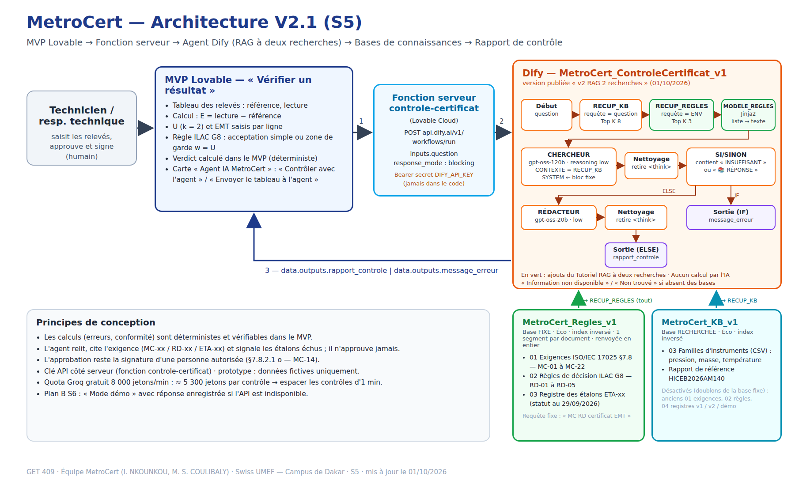

# GET409 — MetroCert

> Générateur de certificats d'étalonnage multi-instruments et multi-sociétés, conformes à l'ISO/IEC 17025:2017.

## Notre équipe

| Prénom Nom | Rôle | GitHub |
|---|---|---|
| Ivon NKOUNKOU | Chef de Produit (PM) · Dev UI (No-Code) · Prompt Engineer · Responsable Impact & Éthique | @nherrys2026-max |

Contact GitHub de l'équipe : nherrys2026@gmail.com

## État du projet (02/10/2026)

| Séance | État |
| --- | --- |
| S1–S2 · Carte d'empathie, HMW, VPC | ✅ |
| S4 · MVP Lovable | ✅ en ligne : [pixel-perfect-capture-0446.lovable.app](https://pixel-perfect-capture-0446.lovable.app) |
| S5 · Agent Dify RAG + webhook | ✅ tests T1–T8 réussis sur le site public |
| S6 · Démo + note d'éthique | ✅ prêtes, répétition technique faite le 02/10 — [demo-s6.md](docs/s6/demo-s6.md) |
| S7 · Vidéo teaser | ✅ [MP4](livrables/GET409-MetroCert_Teaser_S7.mp4) · [Drive](https://drive.google.com/file/d/1MZlczOea9-hb6dAhMX_aC0hCcxFFewBT/view?usp=sharing) |

Reste à faire par l'équipe : captures Dify (L2 S5), dépôts e-Academy, répétition orale de la démo.

## Notre défi

**Secteur :** Industrie et qualité — métrologie et étalonnage des instruments de mesure (laboratoires d'étalonnage, services métrologie internes des industries agroalimentaire, pharmaceutique, pétrole et gaz, mines, BTP), Sénégal / zone UEMOA.

**Problème (1 phrase) :** Au Sénégal, les laboratoires d'étalonnage rédigent encore leurs certificats à la main dans des modèles Word/Excel différents pour chaque type d'instrument et chaque client, ce qui génère des erreurs, des retards de livraison et des écarts relevés lors des audits d'accréditation.

**HMW définitif (S2) :**

> « Comment pourrions-nous permettre aux **responsables techniques de laboratoires d'étalonnage au Sénégal, comme Mame Diarra**, qui jonglent avec un modèle de certificat différent par famille d'instruments et par client, de **passer des relevés de mesure à un certificat conforme à l'ISO/IEC 17025 sans aucune ressaisie**, afin de **livrer leurs clients dans la journée** et de **passer leurs audits d'accréditation sans écart** lié aux certificats ? »

*HMW S1 : « Comment pourrions-nous permettre aux techniciens et responsables de laboratoires d'étalonnage de générer, pour n'importe quel instrument et n'importe quelle société cliente, un certificat d'étalonnage conforme à l'ISO/IEC 17025 en quelques minutes, afin de supprimer les erreurs de recopie et de livrer leurs clients plus rapidement ? »*

Par rapport à la S1, le HMW définitif garde un seul utilisateur principal (le persona est nommé), remplace « n'importe quel instrument / société » par la cause observée (un modèle par famille et par client), retire la solution implicite (« générer ») et fixe des résultats mesurables : livraison dans la journée, zéro écart d'audit lié aux certificats. Détail : [docs/hmw-definitif.md](docs/hmw-definitif.md)

Énoncés S1 : [hmw.md](hmw.md) · Persona et carte d'empathie : [carte-empathie.md](carte-empathie.md) · Concept de l'application : [docs/concept-application.md](docs/concept-application.md)

## Livrables S1

- [ ] Fiche équipe soumise (Google Forms + PDF sur e-Academy) — voir [docs/fiche-equipe.md](docs/fiche-equipe.md)
- [x] Carte d'empathie — [carte-empathie.md](carte-empathie.md)
- [x] Énoncé HMW — [hmw.md](hmw.md)
- [x] Compte Dify créé (workflow `MetroCert_ControleCertificat_v1_[HERRYSTEAM]`)

## Livrables S2

| Livrable | Fichier | Statut |
|---|---|:-:|
| **Value Proposition Canvas** (6 blocs + FIT) | [docs/vpc.md](docs/vpc.md) · [image](docs/vpc-metrocert.svg) · PDF sur e-Academy | ✅ |
| **HMW définitif** (énoncé final) + pitch 2 min | [docs/hmw-definitif.md](docs/hmw-definitif.md) | ✅ |
| **Journal de Prompts** (5 entrées S2 : Zero-Shot, Few-Shot, CoT, libre) | [docs/journal-prompts.md](docs/journal-prompts.md) | ✅ |
| Capture du pitch HMW (recommandé) | Script dans [docs/hmw-definitif.md](docs/hmw-definitif.md#pitch-hmw--2-minutes) | ✅ |

## Livrables S4 — MVP V1 (Lovable)

| Livrable | Fichier / lien | Statut |
| --- | --- | --- |
| **L1 · MVP V1 en ligne** (35 pts) | [pixel-perfect-capture-0446.lovable.app](https://pixel-perfect-capture-0446.lovable.app) | ✅ |
| **L2 · Projet Lovable public + README** (25 pts) | Projet Lovable « Pixel Perfect Pixels », site public [pixel-perfect-capture-0446.lovable.app](https://pixel-perfect-capture-0446.lovable.app) · README : ce dépôt · code non encore exporté vers GitHub | ✅ |
| **L3 · Journal de prompts S4** (init + 3 itérations) | [docs/s4/s4-mvp-lovable.md §4](docs/s4/s4-mvp-lovable.md#4-journal-de-prompts-s4-l3--min-4-prompts) | ✅ 5 prompts notés |
| **L4 · Captures + note d'itération** | [docs/s4/s4-mvp-lovable.md §5](docs/s4/s4-mvp-lovable.md#5-note-ditération-l4--½-page-brouillon-à-ajuster) | ✅ |

Prompts prêts à coller : [docs/s4/s4-mvp-lovable.md](docs/s4/s4-mvp-lovable.md).

## Livrables S5 — MVP V2 : RAG + webhook

| Livrable | Fichier / lien | Statut |
| --- | --- | --- |
| **L1 · MVP V2 avec webhook** (30 pts) | MVP Lovable, page « Vérifier un résultat » → carte « Agent IA MetroCert » ; appel par la fonction serveur `controle-certificat` (secret `DIFY_API_KEY`). URL publique : [pixel-perfect-capture-0446.lovable.app/verifier-resultat](https://pixel-perfect-capture-0446.lovable.app/verifier-resultat) | ✅ testé en ligne le 02/10 (PC + Android) |
| **L2 · Pipeline RAG** (30 pts) | RAG à deux recherches : base fixe `MetroCert_Regles_v1` ([kb/fixe/](docs/s5/kb/fixe/)) + base recherchée `MetroCert_KB_v1` — [docs/s5/s5bis-rag-deux-recherches.md](docs/s5/s5bis-rag-deux-recherches.md) · 2 bases présentes dans Dify (vérifié le 02/10) · captures Dify à faire par l'équipe | ⏳ captures |
| **L3 · Schéma d'architecture V2.1** (20 pts) | [docs/s5/architecture-v2-1.png](docs/s5/architecture-v2-1.png) (V2 initiale : [architecture-v2.png](docs/s5/architecture-v2.png)) | ✅ |
| **L4 · Journal de prompts S5** (10 prompts) | [docs/s5/s5-rag-webhook.md](docs/s5/s5-rag-webhook.md#journal-de-prompts-s5-l4--min-3-prompts) | ✅ |
| **Tests de non-régression T1–T6** (S5+, module B) | [docs/s5/s5bis-rag-deux-recherches.md §5](docs/s5/s5bis-rag-deux-recherches.md#5-batterie-de-tests-t1t6-module-b) | ✅ 6/6 (v2.3) |
| **Mise en ligne, tests publics, secours Gemini** (S5+, modules A et F) | [docs/s5/s5plus-mise-en-ligne.md](docs/s5/s5plus-mise-en-ligne.md) — clé de secours `Gemini_MetroCert` dans Dify, bascule en 2 min | ✅ |
| **Fonctionnalité IA innovante** (S5+, module D) | 3 propositions notées (F1 24/25 · F3 19/25 · F2 15/25), F1 « validation et renvoi au technicien » implémentée dans Lovable, tests T7–T8 — [docs/s5/module-d-fonctionnalites.md](docs/s5/module-d-fonctionnalites.md) | ✅ T7–T8 sur le site public (02/10) |

Agent Dify : `MetroCert_ControleCertificat_v1_[HERRYSTEAM]` — Workflow — version publiée **« v2.3 bilan doublons »** (01/10/2026) — CHERCHEUR Groq `gpt-oss-120b`, RÉDACTEUR Groq `gpt-oss-20b` (reasoning low). Limite du palier gratuit Groq : un contrôle par minute.



## S6 — Évaluation intermédiaire

| Élément | Fichier | Statut |
| --- | --- | --- |
| **Démo 10 min** (C1 MVP /4 · C2 architecture /2 · C3 clarté /2) | [docs/s6/demo-s6.md](docs/s6/demo-s6.md) — déroulé minuté, entrées à coller, questions du jury | ✅ prêt |
| **Plan B** (panne API) | [docs/s6/demo-s6.md#plan-b](docs/s6/demo-s6.md#plan-b) — réponses réelles enregistrées sur le site public | ✅ |
| **Note d'éthique IA** (biais RAG, confidentialité, impact socio-économique) | [docs/s6/note-ethique-s6.md](docs/s6/note-ethique-s6.md) | ✅ |

## S7 — Vidéo teaser

| Livrable | Fichier | Statut |
| --- | --- | --- |
| **Script vidéo** (4 actes × 15 s, voix off, prompts Kling AI) | [docs/s7/script-video-s7.md](docs/s7/script-video-s7.md) | ✅ prêt |
| **L2 · Vidéo teaser** MP4 65 s, 1080p 16:9, sous-titres incrustés | [livrables/GET409-MetroCert_Teaser_S7.mp4](livrables/GET409-MetroCert_Teaser_S7.mp4) · [lien Google Drive](https://drive.google.com/file/d/1MZlczOea9-hb6dAhMX_aC0hCcxFFewBT/view?usp=sharing) | ✅ produite · déposée sur Drive (02/10) · ⏳ e-Academy |

Lien de démo : **[pixel-perfect-capture-0446.lovable.app/verifier-resultat](https://pixel-perfect-capture-0446.lovable.app/verifier-resultat)**

## Structure du dépôt

```
GET409-MetroCert/
├── README.md                    ← ce fichier
├── carte-empathie.md            ← livrable S1 obligatoire
├── hmw.md                       ← énoncés « Comment pourrions-nous… »
├── livrables/                   ← PDF à déposer sur e-Academy
│   ├── GET409-MetroCert_Fiche-Equipe.pdf
│   └── GET409-MetroCert_Carte-Empathie_HMW.pdf
└── docs/
    ├── vpc.md                   ← S2 · Value Proposition Canvas
    ├── vpc-metrocert.svg        ← S2 · visuel du VPC
    ├── hmw-definitif.md         ← S2 · HMW définitif + pitch
    ├── concept-application.md   ← vision produit et périmètre du MVP
    ├── guide-entretien.md       ← questions pour valider la carte d'empathie
    ├── fiche-equipe.md          ← réponses à reporter dans le Google Forms
    ├── journal-prompts.md       ← traçabilité de l'usage de l'IA (S1 à S5)
    ├── s4/
    │   └── s4-mvp-lovable.md    ← S4 · prompts Lovable, journal, note d'itération
    └── s5/
        ├── s5-rag-webhook.md          ← S5 · RAG, webhook, journal de prompts, plan B
        ├── s5bis-rag-deux-recherches.md ← S5 bis · base fixe, workflow publié, tests T1–T6, versions
        ├── module-d-fonctionnalites.md ← S5+ module D · 3 fonctionnalités notées, spec F1, T7–T8
        ├── s5plus-mise-en-ligne.md    ← S5+ · lien public, tests en ligne, secours Gemini, check-list
        ├── architecture-v2-1.png/.html ← S5 · L3 (schéma à jour) ; architecture-v2.* = V2 initiale
        ├── prompts/                   ← prompts SYSTEM publiés (CHERCHEUR, RÉDACTEUR)
        ├── code/                      ← nœuds Code Dify (Nettoyage CHERCHEUR / RÉDACTEUR)
        ├── captures/                  ← captures L1 / L4
        └── kb/                        ← base recherchée MetroCert_KB_v1 (+ fixe/ : base MetroCert_Regles_v1)
    └── s6/
        ├── demo-s6.md                 ← S6 · script de démo 10 min + plan B
        └── note-ethique-s6.md         ← S6 · note d'éthique IA (1 page)
    └── s7/
        └── script-video-s7.md         ← S7 · script du teaser, prompts Kling, montage CapCut
```
